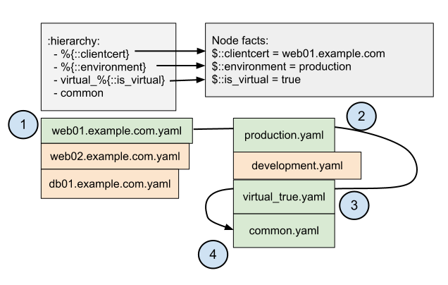
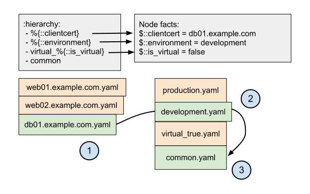

Hiera utiliza una jerarquía ordenada para buscar información. Esto te permite obtener una gran cantidad de información común y sustituir cantidades más pequeñas de lo que sea necesario.

## Ubicación y sintaxis

Hiera carga la jerarquía desde el [archivo de configuración Hiera.yaml](http://docs.puppetlabs.com/es/hiera/configuring.html). La jerarquía debe ser el valor de nivel superior de la clave **:hierarchy**

La jerarquía debe ser un **array**; otra alternativa es que sea un string, que será considerada como un array de un solo elemento.

Cada elemento en la jerarquía debe ser un **string**, el cual puede incluir o no un [símbolo de interpolación de variable](http://docs.puppetlabs.com/es/hiera/variables.html). Hiera tratará a los elementos de la jerarquía como **el nombre de una [fuente de información](http://docs.puppetlabs.com/hiera/1/data_sources.html)**.

	# /etc/hiera.yaml
	---
	:hierarchy:
	- %{::clientcert}
	 - %{::environment}
	- virtual_%{::is_virtual}
	- common

## Terminología
Usamos estos dos términos dentro de los documentos de Hiera y en varios otros lugares.

+ **Fuente de información estática** – Es un elemento de la jerarquía **sin** ningún símbolo de interpolación. La fuente de información estática será la misma para cada nodo. En el ejemplo debajo, **common** es una fuente de información estática. Una máquina virtual llamada **web01** y una física llamada **db01**, ambas deberán usar **common**.
+ **Fuente de información dinámica:** Un elemento de jerarquía con, al menos, un símbolo de interpolación. Si dos nodos tienen diferentes valores para las variables a las que hacen referencia, la fuente de información dinámica usará dos fuentes de información diferentes para esos nodos. En el ejemplo debajo, la variable especial de Puppet **$::clientcert** tiene un valor único para cada nodo. Una máquina llamada **web01** deberá tener una fuente de información llamada **web01** en el nivel superior de su jerarquía. Mientras que una máquina llamada **db01** deberá tener **db01**.

## Comportamiento
### Orden
Cada elemento de la jerarquía tiene el nombre de una [fuente de información](http://docs.puppetlabs.com/es/hiera/data_sources.html). Hiera chequeará esas fuentes **en orden**, comenzando por la primera.

+ Si la fuente de información no existe en la jerarquía, Hiera irá a la próxima fuente de información.
+ Si la fuente de información existe, pero no tiene la pieza de información que Hiera está buscando, irá a la próxima fuente de información. Como el objetivo es ayudar a no cometer repeticiones, Hiera espera que la mayoría de las fuentes de información no existan o no contengan la información.
+ Si el valor es encontrado:
	- En una búsqueda normal [(búsqueda de prioridad)](http://docs.puppetlabs.com/es/hiera/lookup_types.html#priority-default), Hiera se detendrá en la primera fuente de información que contenga la información solicitada y devolverá ese valor.
	- En una búsqueda de [array](http://docs.puppetlabs.com/es/hiera/lookup_types.html#array-merge), Hiera continuará y luego devolverá todos los valores descubiertos como un array plano. Los valores de más importancia en la jerarquía serán los primeros elementos en el array, y los de menos importancia, luego.
	- En una búsqueda de [hash](http://docs.puppetlabs.com/es/hiera/lookup_types.html#hash-merge), Hiera continuará, **esperando que todos los valores sean un hash** y dando error si algún valor que no sea un hash fuese descubierto. Luego, combinará todos los hashes descubiertos y devolverá el resultado, permitiendo que valores con mayor jerarquía sean reemplazados por valores de menor jerarquía.
+ Si Hiera atraviesa toda la jerarquía sin encontrar ningún valor, usará el valor por defecto si lo tiene, o fallará si no lo tiene.

### Backends múltiples
Puedes [especificar múltiples backends como un array en hiera.yaml](http://docs.puppetlabs.com/es/hiera/configuring.html). Si lo haces, funcionarán como una **segunda jerarquía**.

Hiera le dará prioridad al primer backend, y **chequeará cada nivel de la jerarquía** en él antes de ir al segundo backend. Esto significa que, con el siguiente **hiera.yaml**:

	---
	:backends:
	- yaml
	- json
	:hierarchy:
	  - one
	  - two
	  - three

… Hiera chequearía las siguientes fuentes de información, en orden:

+ **one.yaml**
+ **two.yaml**
+ **three.yaml**
+ **one.json**
+ **two.json**
+ **three.json**

## Ejemplo

Asume la siguiente jerarquía:

	# /etc/hiera.yaml
	---
	:hierarchy:
		- %{::clientcert}
		- %{::environment}
		- virtual_%{::is_virtual}
		- common

… y el siguiente set de fuentes de información:

+ **web01.example.com**
+ **web02.example.com**
+ **db01.example.com**
+ **production.yaml**
+ **development.yaml**
+ **virtual_true.yaml**
+ **common.yaml**

… y el único backend **yaml**
Dados dos nodos diferentes con variables Puppet diferentes, aquí tienes dos maneras en las que la jerarquía puede ser interpretada:

### web01.example.com
#### Variables

+ **::clientcert** =** web01.example.com**
+ **::environment** =** production**
+ **::is_virtual** = **true**

#### Resolución de la fuente de información

#### Jerarquía final

+ web01.example.com.yaml
+ production.yaml
+ virtual_true.yaml
+ common.yaml

### db01.example.com
#### Variables

+ **::clientcert** =**db01.example.com**
+ **::environment** = **development**
+ **::is_virtual** = **false**

#### Resolución de la fuente de información

#### Jerarquía final

+ db01.example.com.yaml
+ development.yaml
+ common.yaml

Ten en cuenta que, como **virtual_false.yaml** no existe, es ignorada por completo.

