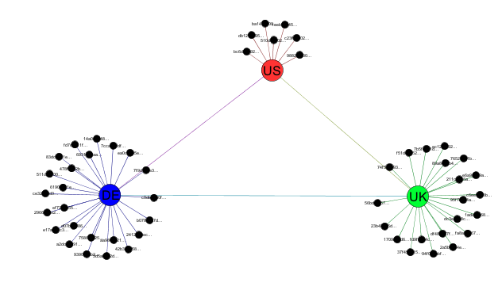

[ActiveMQClustering]: /mcollective1.2/reference/integration/activemq_clusters.html
[MessageFlow]: messageflow.html

# {{page.title}}

 * TOC Placeholder
 {:toc}

# Overview

By default all servers are part of a single broadcast domain, if you have an
agent on all machines in your network and you send a message directed to
machines with that agent they will all get it regardless of filters.

This works well for the common use case but can present problems in the
following scenarios:

 * You have a very big and busy network.  With thousands of machines responding
   to requests every 10 seconds very large numbers of messages will be created
   and you might want to partition the traffic.
 * You have multiple data centers on different continents, the latency and
   volume of traffic will be too big.  You'd want to duplicate monitoring and
   management automations in each datacenter but as it's all one broadcast
   domain you still see large amount of traffic on the slow link.
 * You can't just run multiple seperate installs because you still wish to
   retain the central management feature of MCollective.
 * Securing a flat network can be problematic.  SimpleRPC has a security
   framework that is aware of users and network topology but the core network
   doesnt.

In version _1.1.3_ we've introduced the concept of sub collectives that lets you
define broadcast domains and configure a mcollective server to belong to one or
many of these domains.

# Partitionion Approaches

Determining how to partition your nework can be a very complex subject and
requires an understanding of your message flow, where requestors sit and also
the topology of your middleware clusters.

Most middleware solutions will only send traffic where they know there exist an
interest in this traffic.  Therefore if you had an agent on only 10 of 1000
machines only those 10 machines will receive the associated traffic.  This is an
important distinction to keep in mind.

We'll be working with a small 52 node collective that you can see above, the
collective has machines in many data centers spread over 4 countries.  There are
3 ActiveMQ servers connected in a mesh.

Along with each ActiveMQ node is also a Puppet Master, Nagios instance and other
shared infrastructure components.

An ideal setup for this network would be:

 * MCollective NRPE and Puppetd Agent on each of 52 servers
 * Puppet Commander on each of the 3 ActiveMQ locations
 * Nagios in each of the locations monitoring the machines in its region
 * Regional traffic will be isolated and contained to the region as much as
   possible
 * Systems Administrators and Registration data retain the ability to target the
   whole collective

The problem with a single flat collective is that each of the 3 Puppet
Commanders will get a copy of all the traffic, even traffic they did not request
they will simply ignore the wrong traffic.  The links between Europe and US will
see a large number of messages traveling over them.  In a small 52 node traffic
this is managable but if each of the 4 locations had thousands of nodes the
situation will rapidly become untenable.

It seems natural then to create a number of broadcast domains - subcollectives:

 * A global collective that each machines belongs to
 * UK, DE, ZA and US collectives that contains just machines in those regions
 * An EU collective that has UK, DE and ZA machines

Visually this arrangement might look like the diagram below:

Notice how subcollectives can span broker boundaries - our EU collective has nodes
that would connect to both the UK and DE brokers.

We can now configure our Nagios and Puppet Commanders to communicate only to the
sub collectives and the traffic for these collectives will be contained
regionally.

The graph below shows the impact of doing this, this is the US ActiveMQ instance
showing traffic before partitioning and after.  You can see even on a small
network this can have a big impact.

# Configuring MCollective

Configuring the partitioned collective above is fairly simple.  We'll look at
one of the DE nodes for reference:


topicprefix = /topic/
collectives = mcollective,de_collective,eu_collective
main_collective = mcollective


The _collectives_ directive tells the node all the collectives it should belong
to and the _main`_`collective_ instructs Registration where to direct messages
to.

# Partitioning for Security

Another possible advantage from subcollectives is security.  While the SimpleRPC
framework has a security model that is aware of the topology the core network
layer does not.  Even if you only give someone access to run SimpleRPC requests
against some machines they can still use _mc ping_ to discover other nodes on
your network.

By creating a subcollective of just their nodes and restricting them on the
middleware level to just that collective you can effectively and completely
create a secure isolated zone that overlays your exiting networok.

# Testing

Testing that it works is pretty simple, first we need a _client.cfg_ that
configures your client to talk to all the sub collectives:


topicprefix = /topic/
collectives = mcollective,uk_collective,us_collective,de_collective,eu_collective,us_collective,za_collective
main_collective = mcollective


You can now test with _mc ping_:


$ mc ping -T us_collective
host1.us.my.net         time=200.67 ms
host2.us.my.net         time=241.30 ms
host3.us.my.net         time=245.24 ms
host4.us.my.net         time=275.42 ms
host5.us.my.net         time=279.90 ms
host6.us.my.net         time=283.61 ms
host7.us.my.net         time=370.56 ms

---- ping statistics ----
7 replies max: 370.56 min: 200.67 avg: 270.96


By specifying other collectives in the -T argument you should see the sub
collectives and if you do not specify anything you should see all machines.

Clients don't need to know about all collectives, only the ones they intend
to communicate with.

You can discover the list of known collectives and how many nodes are in each
using the _inventory_ application:


$ mc inventory --list-collectives

 * [ ==================================== ] 52 / 52

   Collective                     Nodes
   ==========                     =====
   za_collective                  2
   us_collective                  7
   uk_collective                  19
   de_collective                  24
   eu_collective                  45
   mcollective                    52

                     Total nodes: 52



# ActiveMQ Filters

The above setup should just work in most cases but you might want to go one step
further and actively prevent propagation across the network of sub collective
traffic.

In your ActiveMQ broker setup you will already have a section defining your
network connections, something like:


<networkConnectors>
  <networkConnector
     name="us-uk"
     uri="static:(tcp://stomp1.uk.my.net:6166)"
     userName="amq"
     password="secret"
     duplex="true" />
</networkConnectors>


You can add filters here restricting traffic in this case the US<->UK connection
should never transmit _us`_`collective_ traffic, so lets restrict that:


<networkConnectors>
  <networkConnector
     <excludedDestinations>
       <topic physicalName="us_collective.>" />
       <topic physicalName="uk_collective.>" />
       <topic physicalName="de_collective.>" />
       <topic physicalName="za_collective.>" />
       <topic physicalName="eu_collective.>" />
     </excludedDestinations>
     name="us-uk"
     uri="static:(tcp://stomp1.uk.my.net:6166)"
     userName="amq"
     password="secret"
     duplex="true" />
</networkConnectors>

