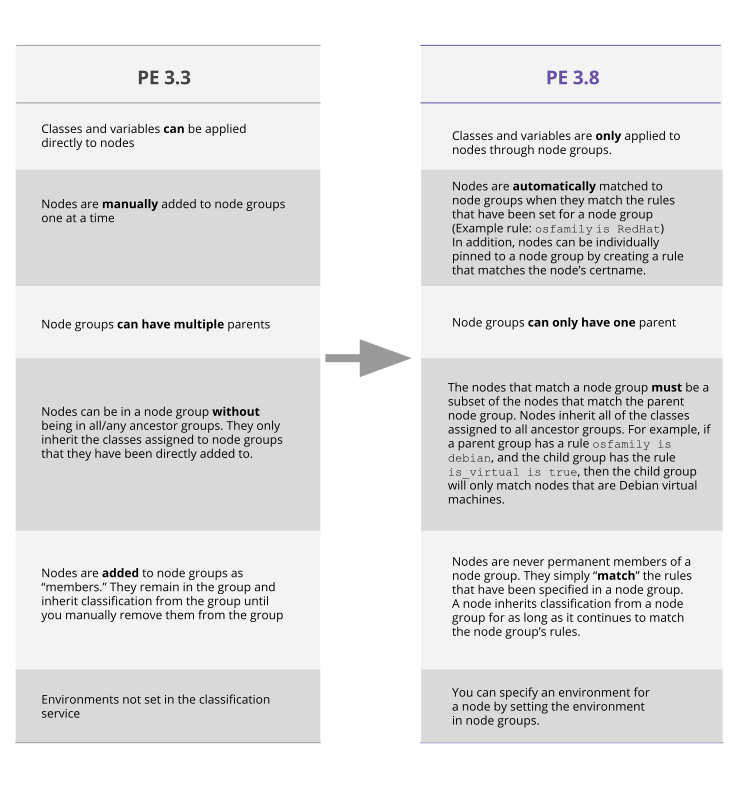

## Who Should Use the PE Classification Data Migration Tool?

If you are currently on PE 3.3 and you classify your nodes through the console, you should use the migration tool when upgrading to PE 3.8. 

### Why? 

PE 3.7 introduced major improvements to the node classification process, including the ability to dynamically add nodes to node groups using rules, and the classification of nodes at the node group level rather than the node level. This is part of PE’s shift towards treating nodes as cattle rather than pets in order to achieve greater automation and scalability. 

The node-based classification system used in PE 3.3 and earlier versions does not translate directly to node group classification in PE 3.7 due to some data incompatibility issues. PE 3.8 comes with a tool to help you migrate the classification data that you used in PE 3.3. 

> **Note:** The migration tool **only** assists with upgrades from **PE 3.3** to **PE 3.8** and is designed to skip PE 3.7. If you are using node classification in PE 3.3 we **do not** recommend upgrading to PE 3.7.

The major differences between classification in PE 3.3 and PE 3.8 are shown in the following diagram.  

<a href="./images/pe3.8_migration_differences.svg"> (Click to enlarge)</a>

## What is the PE Classification Data Migration Tool?

The migration tool is a command line tool that provides a smooth path for migrating classification data from PE 3.3 to PE 3.8. To migrate your classification data, you need to:

* Export your PE 3.3 classification data to a JSON file (using the migration tool)
* Convert your PE 3.3 classification data into PE 3.8-compatible data (using the migration tool)
* If the migration tool identifies conflicts, resolve the conflicts manually (does not use the migration tool)
* Upgrade from PE 3.3 to PE 3.8 (does not use the migration tool)
* Import your PE 3.3 data into PE 3.8 (using the migration tool)

Each of these steps are described in detail as you work through this documentation.

## Requirements

To use the migration tool, you must:

* Be on the 3.3.2 version of PE. The quickest way to check your version is to run `facter puppetversion` in the command line and see what is returned for the Puppet Enterprise version. If you are on an older version of PE, [upgrade to the latest version](./install_upgrading.html).
* Be using the PE-provided postgres instance. User-provided postgres installations are not supported.
* Have pe-java installed on any hosts that you install the migration tool on 

**Note:** The migration tool does not support classification that was created using Hiera.

## Overview of the Migration Process

### Flow of the PE 3.3 to PE 3.8 Migration Process 

<a href="./images/console/env_workflow.svg"> (Click to enlarge)</a>

After successful migration from PE 3.3 to PE 3.8 in the flow shown above, your PE 3.8 installation will have:

> 

> <b>Converted PE 3.3 classification data</b>
> 

> 

> <b>+</b>
> 

> 

> <b>Preconfigured node groups created during the PE 3.3 > PE 3.8 upgrade</b>
> 

### What Gets Migrated?

* Node name
* Node description
* Node classification information (which variables, classes and parameters are assigned to the node)
* Node's group membership
* Node group name
* Node group description
* Group classification information (which variables, classes and parameters are assigned to the group)
* Group's member nodes
* Group's parent group
* Node group hierarchy

### What Doesn’t Get Migrated? 

* Preconfigured infrastructure-related classification
* Node groups that have multiple parents
* Classification that is applied both directly to nodes and through node groups
* Node group membership if a node doesn’t belong to all ancestors of the node group

## Instructions For Upgrading to PE 3.8 Using the Migration Tool

The process for migrating your classification data is slightly different depending on whether you have a monolithic installation (the master, console, and PuppetDB components are all installed on the same server) or a split installation (the master, console, and PuppetDB components are installed on different servers).

If you have a monolithic installation, follow the instructions in [Instructions For Upgrading a Monolithic Installation](./install_upgrade_migration_monolithic.html).

If you have a split installation, follow the instructions in [Instructions For Upgrading a Split Installation](./install_upgrade_migration_split.html).

> **Warning:** You must export your PE 3.3 classification data **before** upgrading to PE 3.8.

* * *

- [If you have a monolithic install, proceed to Migrating a Monolithic Installation](./install_upgrade_migration_monolithic.html)
- [If you have a split install, proceed to Migrating a Split Installation](./install_upgrade_migration_split.html)