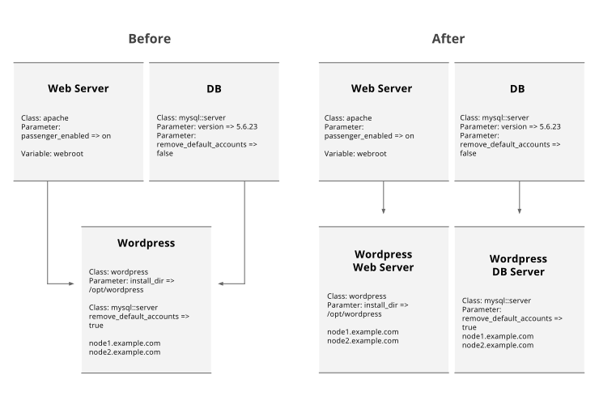
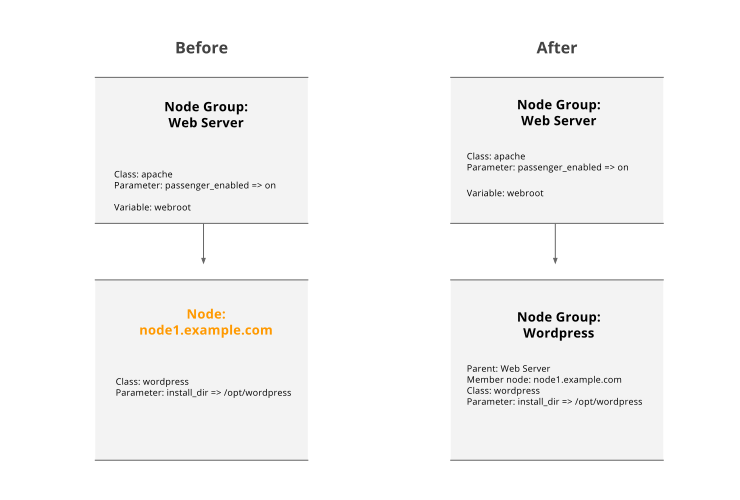

In PE 3.3, there are four ways of grouping and classifying nodes that are not compatible with node classification in PE 3.8. These are:

1. A node group with multiple parent groups (a conflict that must be resolved manually)
2. A node that is a member of a node group but is not a member of all of the node group’s ancestors (a conflict that must be resolved manually)
3. A node that has classification applied to it directly as well as through node groups (a conflict that must be resolved manually)
4. A node that has classification applied to it directly and is not in a node group (an incompatible configuration that the migration tool will handle for you)

For background on why these configurations are not compatible with PE 3.8, see [Differences in PE 3.3 and PE 3.8 Node Classification](./install_upgrade_migration_tool.html#why).

If your PE 3.3 console classification includes any of the incompatible configurations that require manual resolution, the migration tool will identify the conflicts for you. If you want to continue with the migration, you must manually resolve each of the conflicts in the console and then attempt the migration again. Each type of conflict and the recommended conflict resolution are explained below. As you resolve each of the conflict states, try to think of your nodes as cattle, not pets. In other words, find the commonalities between your nodes, and group them accordingly so that you can apply classification to many nodes through a single node group rather than having to apply classification to individual nodes. This is explained further in [Getting Started With Classification](./console_classes_groups_getting_started.html).

## Node groups with multiple parents
In PE 3.3, node groups could have multiple parents and member nodes would inherit classification from all parents. In PE 3.8, node groups can only have a single parent. This is because node groups can be used to compose a node’s role in PE 3.8, and as you work your way down a particular branch of the inheritance tree, the role of descendent node groups becomes more and more specific, until you reach the bottom of the inheritance tree, at which point your node group should have the overriding details that are specific to it, in addition to classification that it inherits from every ancestor node group. For more information about inheritance, see [How Does Inheritance Work](./console_classes_groups_inheritance.html). 

If you have node groups in PE 3.3 that have multiple parents, you need to remove the multiple inheritance, but you also need to take steps to preserve your classification. As an example, if you have a child node group with two parents as shown in the figure below, we recommend that you resolve the multiple inheritance conflict as follows:

<a href="./images/pe3.8_migration_multiple_inheritance.svg"> (Click to enlarge)</a>

1. Split the **Wordpress** child node group into two child node groups, **Wordpress Web Server** and **Wordpress DB Server**.

2. Ensure that the new **Wordpress Web Server** and **Wordpress DB Server** child node groups both have exactly the same nodes as the original **Wordpress** child node group (**node1.example.com** and **node2.example.com**)

3. Make the **Web Server** node group the parent of **Production Wordpress**. Make the **DB** node group the parent of **Production DB**.

4. In PE 3.8, classes, variables, and parameters are inherited from parent node groups, but you can override the parameters and variables set in a parent node group by setting a different value for that parameter or variable in the child node group. In the **Wordpress DB Server** node group, add the `true` value for the `remove_default_accounts` parameter to override the value in the **DB** parent node group. 

5. If you are left with any classification from the original **Wordpress** child node group that doesn’t need to be in the new **Wordpress Web Server** child node group or the new **Wordpress DB Server** child node group (for example, it doesn’t override the classification set in the parent node group, or the classification is not specific to the role of either of the two new child node groups), make a new node group that applies that classification, and add **node1.example.com** and **node2.example.com** to the new node group.

## Nodes with classification applied directly to them as well as through node groups
In PE 3.3, in addition to nodes inheriting classification through node group membership, you can also apply classes to nodes directly. In PE 3.8, nodes are only classified with classes that have been added to node groups that they match. You cannot apply classes directly to the nodes.

If you have classes applied directly to nodes, but the nodes do not inherit from any node groups, you do not need to do anything. See [Nodes that have classification applied directly to them but are not a member of a node group](#nodes-that-have-classification-applied-directly to-them-but-are-not-a-member-of-a-node-group) for more information on how the migration tool handles these nodes. 

As an example of how to resolve this type of conflict, say you have a node called **node1.example.com** that has been classified both directly and through a single node group called **Web Server**. Resolve the conflict as follows:

<a href="./images/pe3.8_migration_direct_indirect_classification.svg"> (Click to enlarge)</a>

1. Create a new node group called **Wordpress Web Server** (for example). Set the parent of the **Wordpress Web Server** node group to be the node group that the node inherits classes from (**Web Server**). 

    > **Note:** If the node group that the node inherits from (**Web Server**) has multiple parents, complete the steps in [Node groups with multiple parents]() first. In the process of resolving the multiple inheritance issue, your nodes will end up being in multiple node groups so you will need to switch to the workflow below for nodes that have been classified both directly and through multiple node groups.

2. In the **Wordpress Web Server** node group, add the classification that was applied directly to the node (the `wordpress` class and the `install_dir` parameter). Then, delete the classification from the node so that the node no longer has any classification applied directly to it. 

3. Add the **node1.example.com** node to the **Wordpress Web Server** node group by pinning the node to the node group.

If you have nodes that have been classified both directly and through multiple node groups, resolve the conflict as follows:

<a href="./images/pe3.8_migration_direct_multiple_indirect.svg"> (Click to enlarge)</a>

1. If a parameter or variable applied directly to the node needs to override the classification data in one of the node groups that is applying it, create a new node group and set the parent to be the node group that you want to override. Add the parameter or variable to the new node group and remove it from the node. Lastly, add the node to the new node group by pinning the node.

2. Repeat step 1 until you have all of your overriding classification data in place.

3. If you have any classification data left over at the end of this process, create a new node group with no parent. Add all remaining classification data to this node group and remove it from the node. Then, add the node to the group.

## Nodes that are not a member of all ancestor groups

In PE 3.3, you could add nodes to a node group even if the node was not a member of the node group’s parent. In PE 3.8, a node group can only match nodes that all of its ancestors also match (think of one branch of the node group inheritance tree as being a funnel in which the number of nodes that match each descendant node group gets smaller and smaller as you work your way down the branch as the rules in each child group filter out some of the nodes that matched the parent node group). 

If you have nodes in a node group that do not appear in all of the node group’s ancestors, the way to resolve this is to add all of the nodes in the node group to all of the group's ancestors. That is, first look at the parent group, and add any nodes from the child group that are missing from the parent group. If the parent itself has a parent (the original group's grandparent), do the same thing for the grandparent. Continue this process until you've added all nodes to all ancestor groups.

## Nodes that have classification applied directly to them but are not a member of a node group
The migration tool can actually convert these nodes ready for import without the need for you to make any manual changes. It does this by:

1. Creating a node group that has the same name as the node’s certname (referred to as a singleton node group)
2. Pinning the node to the node group
3. In the node group, adding the classification that had been applied directly to the node

If you would like the migration tool to automatically create a node group for every node that has classification applied directly but no node group membership, as described above, then you do not need to take action. 
