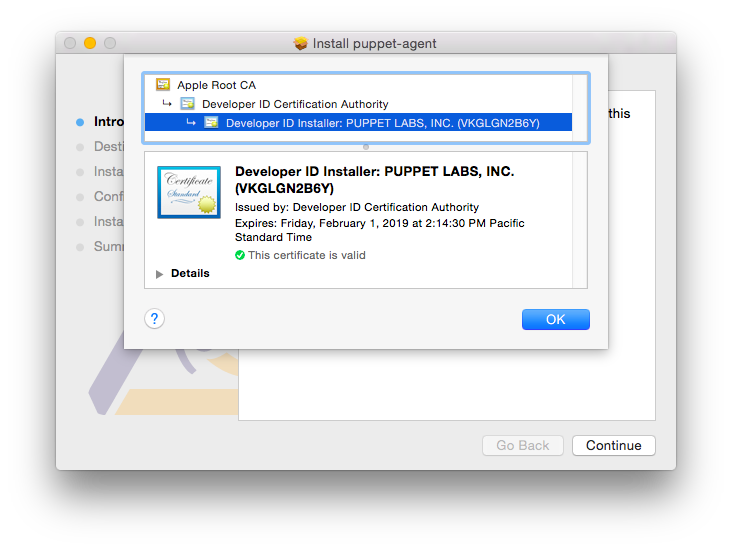



## Puppet Collection contents

Puppet Collection 1 contains the following components:



## Using Puppet Collections



### Yum-based systems













### Apt-based systems















### OS X systems









### Windows systems

Microsoft Installer (MSI) packages for `puppet-agent` are distributed from [downloads.puppetlabs.com](https://downloads.puppetlabs.com/windows/) and aren't directly associated with Puppet Collections. For more information, see the [Windows Agent installation documentation](./install_windows.html).



## Verifying Puppet packages

At Puppet, we sign most of our packages, Ruby gems, and release tarballs with GNU Privacy Guard (GPG). This helps prove that the packages originate from Puppet and have not been compromised.

Security-conscious users can use GPG to verify signatures on our packages.

### Automatic verification

Certain operating system and installation methods automatically verify our package signatures.

-   If you install Puppet packages via our Yum and Apt repositories, the Puppet Collection release package that enables the repository also installs our release signing key. The Yum and Apt tools automatically verify the integrity of our packages as you install them.
-   Our Microsoft Installer (MSI) packages for Windows are signed with a different key, and the Windows installer automatically verifies the signature before installing the package.

In these cases, you don't need to do anything to verify the package signature.

### Manual verification

If you're using Puppet source tarballs or Ruby gems, or installing RPM packages without Yum, you can manually verify the signatures.

#### Import the public key

Before you can verify signatures, you must import the Puppet public key and verify its fingerprint. This key is certified by several Puppet developers and should be available from the public keyservers.

To import the public key, run:



The `gpg` tool then requests and imports the key:





> **Note:** If this is your first time running the `gpg` tool, it might fail to import the key after creating its configuration file and keyring. This is normal, and you can run the command a second time to import the key into your newly created keyring.

#### Verify the fingerprint

The fingerprint of the Puppet release signing key is:



To check the key's fingerprint, run the following:



Then, ensure the fingerprint listed in the output matches the above value:



#### Verify a source tarball or gem

To verify a source tarball or Ruby gem, you must download both it and its corresponding `.asc` file. These files are available from <https://downloads.puppetlabs.com/puppet/>.

Next, verify the tarball or gem by running the following, replacing `<VERSION>` with the Puppet version number, and `<FILE TYPE>` with `tar.gz` for a tarball or `gem` for a Ruby gem:

    gpg --verify puppet-<VERSION>.<FILE TYPE>.asc puppet-<VERSION>.<FILE TYPE>

The output should confirm that the signature matches:



If you have not taken the necessary steps to build a [trust path](https://www.gnupg.org/gph/en/manual/x334.html), through the web of trust, to one of the signatures on the release key, `gpg` produces a warning similar to the following when you verify the signature:



This is normal if you do not have a trust path to the key. If you've verified the fingerprint of the key as described above, GPG has verified the archive's integrity; the warning only means that GPG can't automatically prove the key's ownership.

#### Verify an RPM package

Puppet RPM packages include an embedded signature. To verify it, you must import the Puppet public key to `rpm`, then use `rpm` to check the signature.

First, retrieve the [Puppet public key](http://pool.sks-keyservers.net:11371/pks/lookup?op=get&search=0x1054B7A24BD6EC30) and place it in a file on your node.

Next, run the following, replacing `<PUBLIC KEY FILE>` with the path to the file containing the Puppet public key:

    sudo rpm --import PUBKEY <PUBLIC KEY FILE>

The `rpm` tool won't output anything if successful.

Then to verify an RPM you've downloaded, run the `rpm` tool with the `checksig` flag (`-K`):

    sudo rpm -vK <RPM FILE NAME>

This verifies the embedded signature, as signified by the `OK` results in the `rpm` output:



If you don't import the Puppet public key, you can still verify the package's integrity using `rpm -vK`. However, you won't be able to validate the package's origin:



#### Verify an OS X `puppet-agent` package

Puppet signs `puppet-agent` packages for OS X with a developer ID and certificate. To verify the signature, download and mount the `puppet-agent` disk image, then use the `pkgutil` tool with the `--check-signature` flag:

    pkgutil --check-signature /Volumes/puppet-agent-<AGENT-VERSION>-1.osx10.10/puppet-agent-<AGENT-VERSION>-1-installer.pkg

The tool confirms the signature and outputs fingerprints for each certificate in the chain:



You can also confirm the certificate when installing the package by clicking the lock icon in the top-right corner of the installer:

This displays details about the `puppet-agent` package's certificate:

<!-- Keep information about nightlies on the latest version only. -->